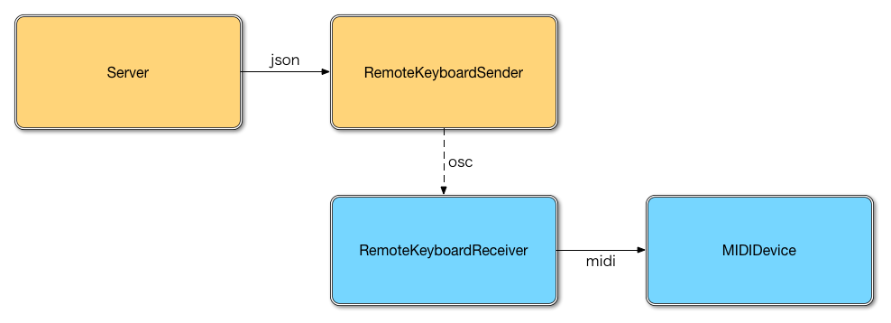

# REMOTE KEYBOARD RECEIVER
> receive osc message - send midi message

## Installation
```
% git clone https://github.com/mohayonao/remote-keyboard-receiver.git
% cd remote-keyboard-receiver
% npm install
```

## Usage

1. connect midi devices to your pc.
2. show available midi devices on your environment.
3. edit `config.json`, set your midi device name to `DEVICE_NAME`
4. run `node .`

```
% node .
>> please set DEVICE_NAME to config.json
>> [0] Midi Through 14:0

% nano config.json

% node .
>> Listening on port 7401
>> YOUR MIDI DEVICE opened
>> > 0x90 0x64 0x64
>> > 0x80 0x64 0x00
```

## Quick Test

```
% node examples/arpeggio.js
>> < 0x90 0x64 0x64
>> < 0x80 0x64 0x00
```

## Architecture

